# gRPC Studio Demo

These light-mode captures use the bundled PetStore example service with gRPC reflection enabled.

## Walkthrough GIF

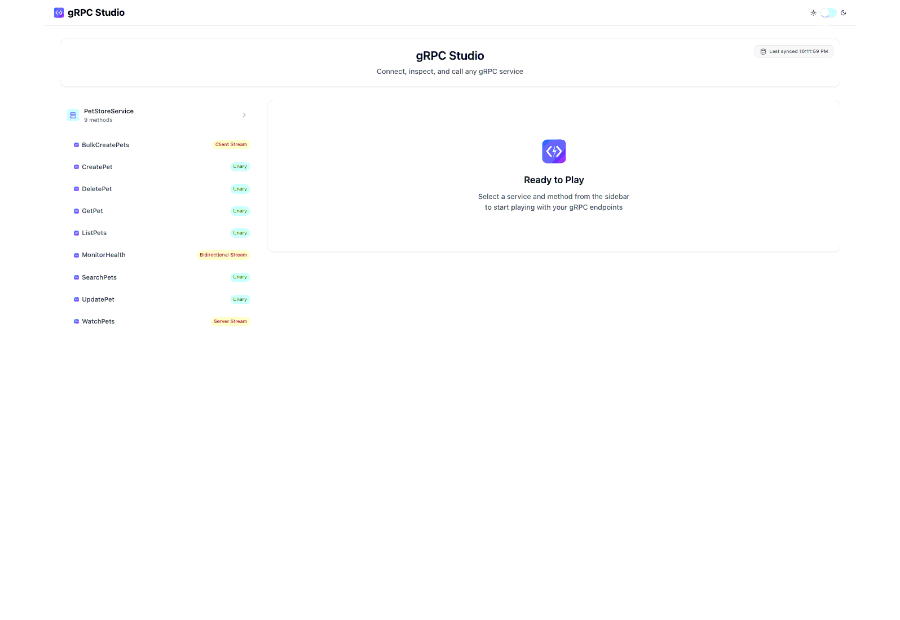

## Screenshot Gallery

| Flow | Capture |
| ---- | ------- |
| Service discovery and all RPC mode badges | 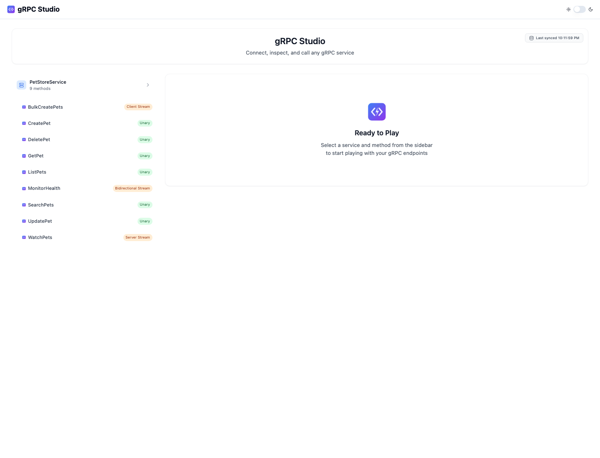 |
| Unary request form input | 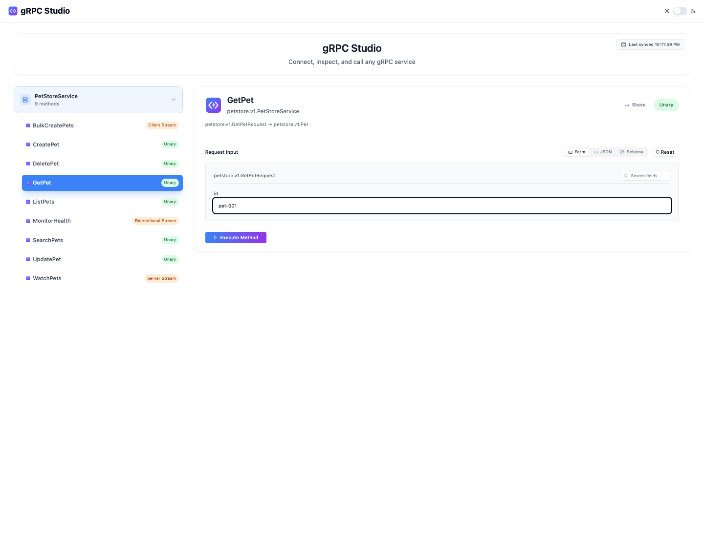 |
| Unary request JSON input | 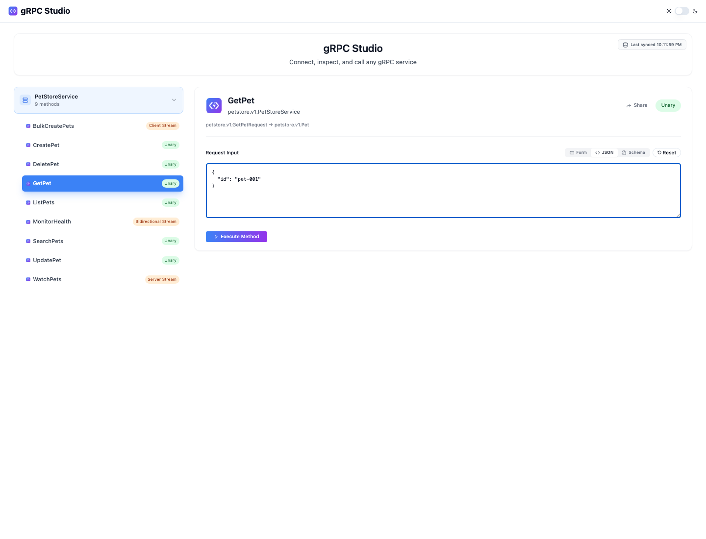 |
| Unary request schema input | 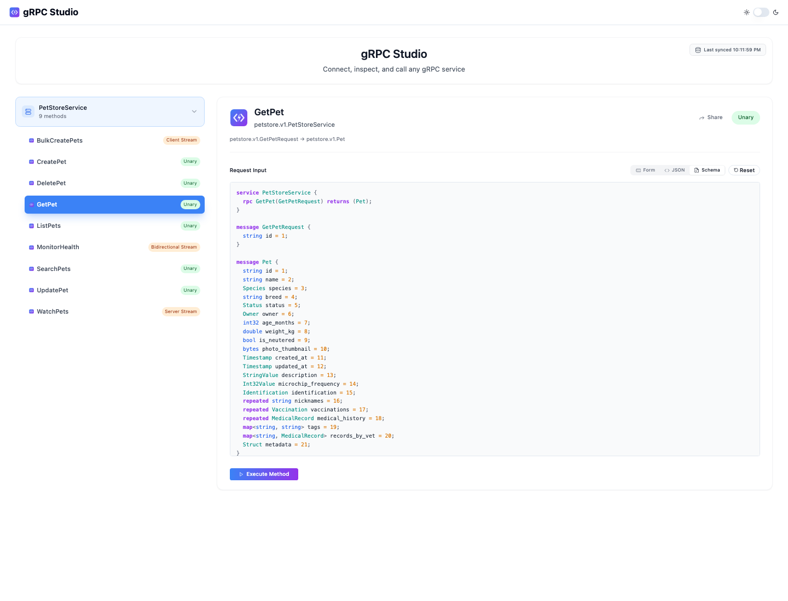 |
| Unary response form output | 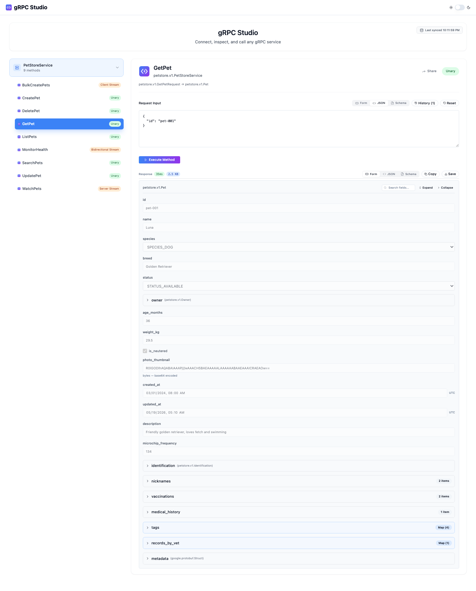 |
| Unary response JSON output | 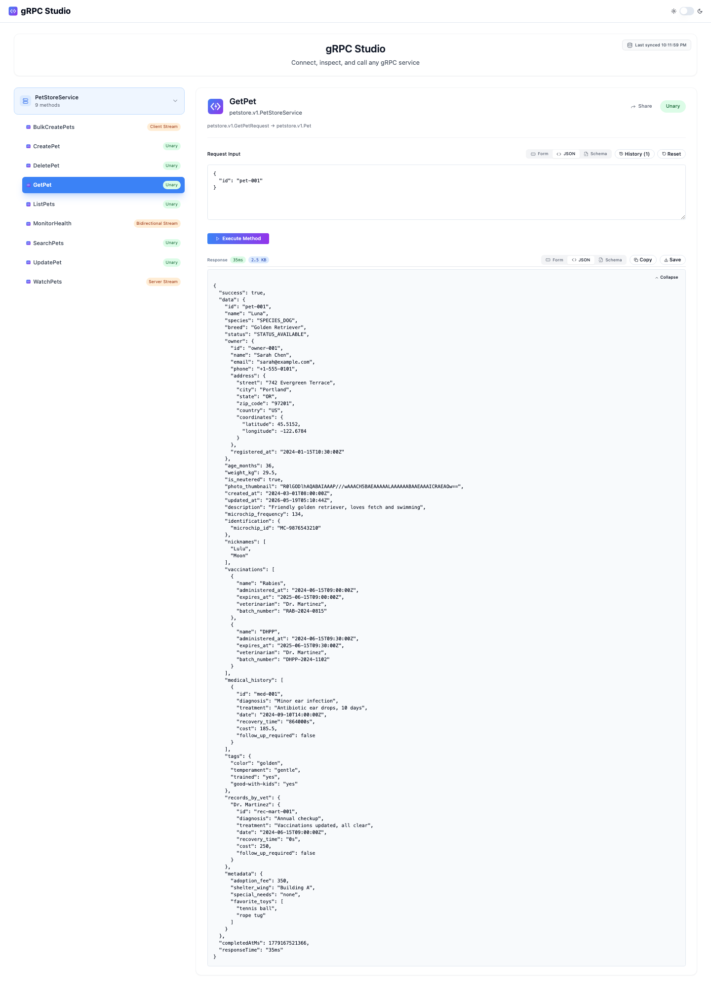 |
| Unary response schema output | 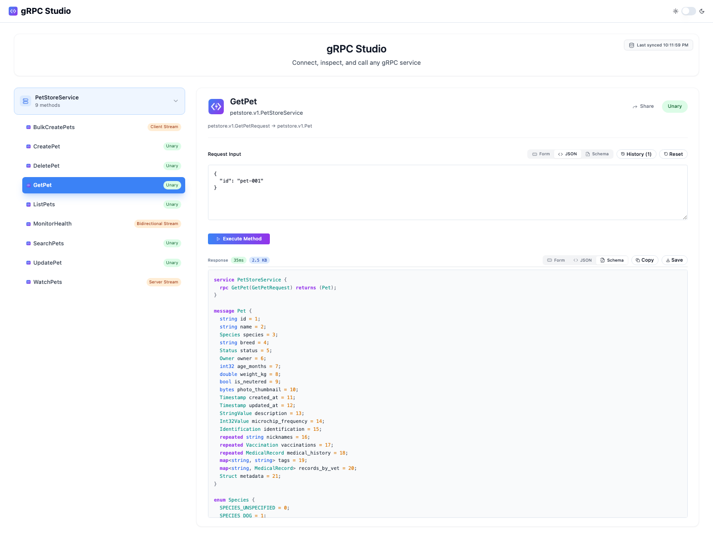 |
| Share action copied state | 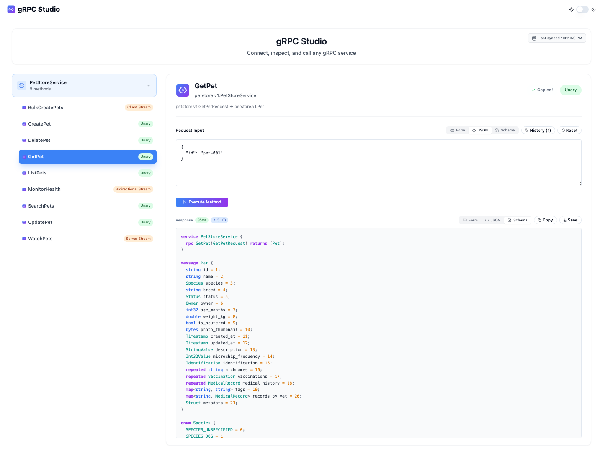 |
| Per-method request history | 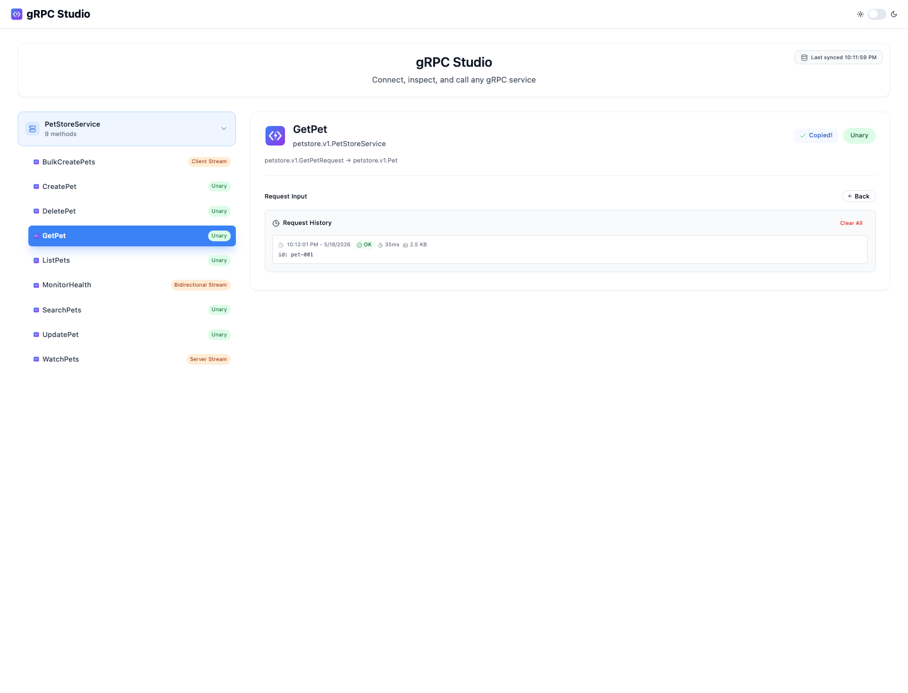 |
| Server streaming | 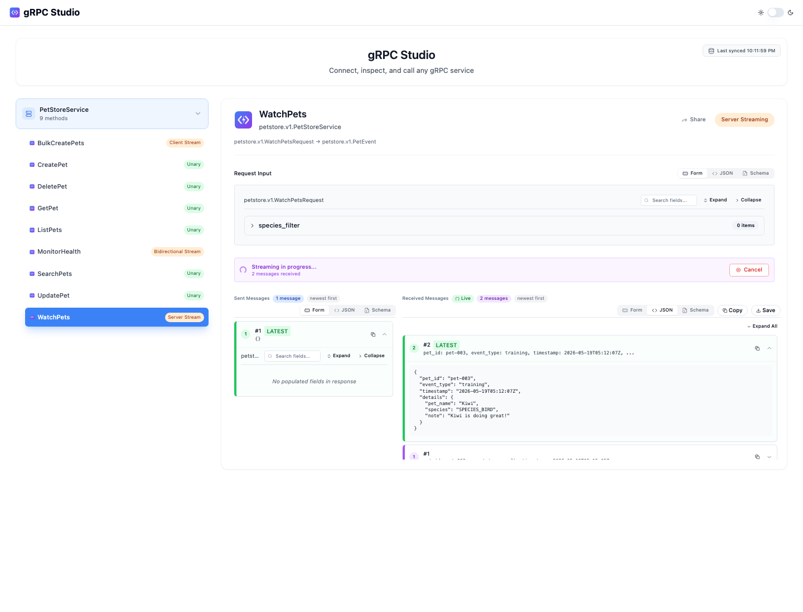 |
| Client streaming | 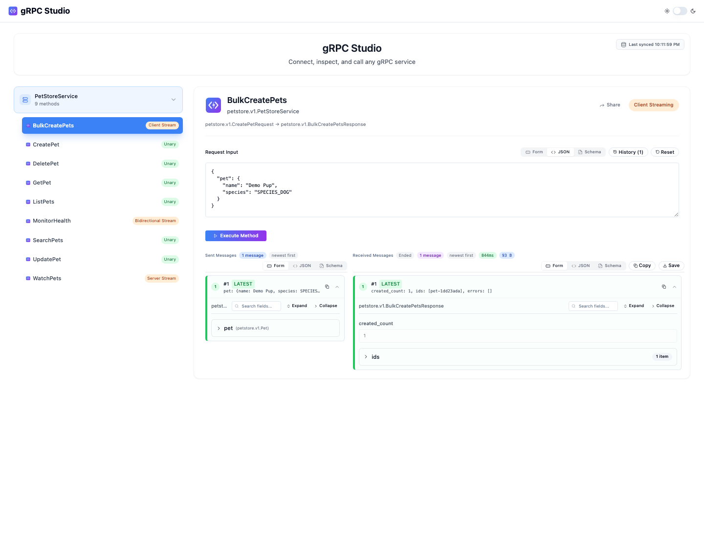 |
| Bidirectional streaming | 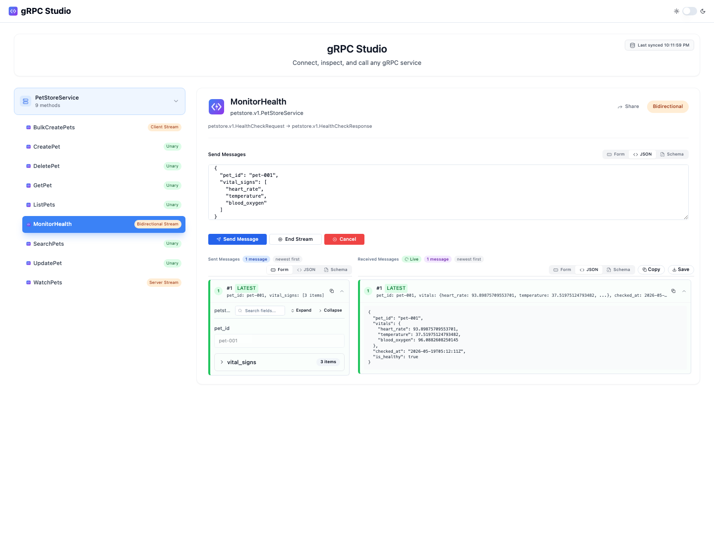 |
