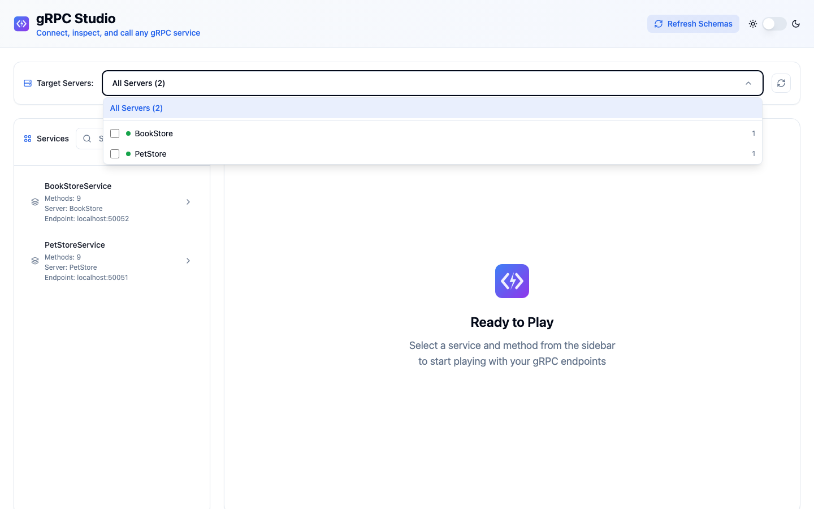

# gRPC Studio Demo

These light-mode captures use the bundled PetStore (`:50051`) and BookStore (`:50052`) example services with gRPC reflection enabled. Run `npm run dev:all` from the repo root to start both alongside the UI.

## Walkthrough

A single continuous tour, split into labeled chapters:

1. **Multi-server support** — connect to PetStore and BookStore at once
2. **Searchable services & methods** — filter the tree as you type
3. **Tabs** — open several methods side by side, duplicate one
4. **Form, JSON & Schema** — edit requests three ways, kept in sync
5. **Streaming** — server and bidirectional streaming, live
6. **Request history** — replay past calls per method
7. **Shareable URLs** — copy a deep link to any request

The MP4 is small enough to embed; the GIF is the fallback for renderers that don't play video.

<video src="grpc-studio-light-mode.mp4" controls width="900"></video>


## Regenerating these assets

The screenshots and the walkthrough video are captured programmatically from the live app:

```bash
npm run dev:all        # start frontend + backend + PetStore + BookStore
npm run demo:capture   # drive the UI, write screenshots + record the walkthrough
npm run demo:gif       # convert the recording to grpc-studio-light-mode.gif  (needs ffmpeg)
npm run demo:mp4       # convert the recording to grpc-studio-light-mode.mp4  (needs ffmpeg)
```

## Screenshot Gallery

| Flow | Capture |
| ---- | ------- |
| Server selection (PetStore + BookStore) |  |
| Service discovery and all RPC mode badges |  |
| Unary request form input |  |
| Unary request JSON input |  |
| Unary request schema input |  |
| Unary response form output |  |
| Unary response JSON output |  |
| Unary response schema output |  |
| Share action copied state |  |
| Per-method request history |  |
| Server streaming |  |
| Client streaming |  |
| Bidirectional streaming |  |
